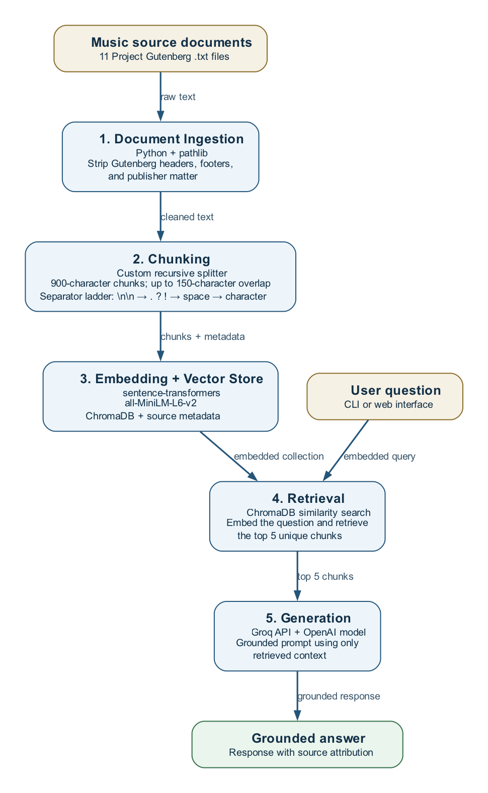

# Project 1 Planning: The Unofficial Guide

> Write this document before you write any pipeline code.
> Your spec and architecture diagram are what you'll use to direct AI tools (Claude, Copilot, etc.) to generate your implementation — the more specific they are, the more useful the generated code will be.
> Update the Retrieval Approach and Chunking Strategy sections if you change your approach during implementation.
> Update this file before starting any stretch features.

---

## Domain

<!-- What domain did you choose? Why is this knowledge valuable and hard to find through official channels? -->
My domain is music knowledge. This spans from instrument construction to good techniques. It can be difficult to find because it is scattered across specialized, often antiquated books whose terminology and structure make them hard to search and synthesize. All of my sources were retrieved from Project Gutenberg.

---

## Documents

<!-- List your specific sources: URLs, subreddit names, forum threads, or file descriptions.
     Aim for at least 10 sources that together cover different subtopics or perspectives within your domain. -->

| # | Source | Description | URL or location |
|---|--------|-------------|-----------------|
| 1 | *A Complete History of Music* — W. J. Baltzell | Broad historical survey of music, including musical forms, composers, and the development of instruments and styles. | `documents/A Complete History of Music.txt`; https://www.gutenberg.org/ebooks/54392 |
| 2 | *Piano Playing, with Piano Questions Answered* — Josef Hofmann | Practical piano pedagogy covering technique, practice, interpretation, sight-reading, and common student questions. | `documents/Piano Playing, with Piano Questions Answered.txt`; https://www.gutenberg.org/ebooks/39211 |
| 3 | *Handbook of Violin Playing* — Carl Schroeder | Instructional violin manual addressing posture, bowing, positions, scales, tone production, and practice exercises. | `documents/HANDBOOK OF VIOLIN PLAYING.txt`; https://www.gutenberg.org/ebooks/73023 |
| 4 | *Italian Harpsichord-Building in the 16th and 17th Centuries* — John D. Shortridge | Study of early Italian harpsichord materials, construction practices, makers, and surviving instruments. | `documents/Italian Harpsichord-Building in the 16th and 17th Centuries.txt`; https://www.gutenberg.org/ebooks/27149 |
| 5 | *Musical Instruments, Historic, Rare and Unique* — Alfred J. Hipkins | Illustrated historical reference to unusual and significant instruments from multiple traditions and periods. | `documents/Musical Instruments, Historic, Rare and Unique.txt`; https://www.gutenberg.org/ebooks/58117 |
| 6 | *First Steps to Bell Ringing* — Samuel B. Goslin | Beginner's guide to bell ringing, with elementary instruction on handling, rhythm, methods, and early practice. | `documents/First Steps to Bell Ringing.txt`; https://www.gutenberg.org/ebooks/53022 |
| 7 | *Practical Organ Building* — W. E. Dickson | Technical guide to organ design and construction, including pipes, wind supply, action, voicing, and installation. | `documents/Practical Organ Building.txt`; https://www.gutenberg.org/ebooks/62257 |
| 8 | *The Coach-Horn* — Old Guard | Historical account of the coach horn, its use in road travel, calls and signals, and social and cultural associations. | `documents/The coach-horn.txt`; https://www.gutenberg.org/ebooks/78978 |
| 9 | *Principles of Orchestration, with Musical Examples Drawn from His Own Works* — Nikolay Rimsky-Korsakov | Foundational orchestration text on instrumental groups, timbre, melody, harmony, orchestral combinations, and voices. | `documents/Principles of Orchestration, with Musical Examples Drawn from His Own Works .txt`; https://www.gutenberg.org/ebooks/33900 |
| 10 | *Chats to 'Cello Students* — Arthur Broadley | Cello technique guide covering holding the instrument, bow strokes, positions, portamento, double-stops, harmonics, and style. | `documents/Chats to 'Cello Students.txt`; https://www.gutenberg.org/ebooks/42378 |
| 11 | *The Highland Bagpipe* — W. L. Manson | History and cultural study of the Highland bagpipe, including its construction, drones, repertoire, pipers, and military use. | `documents/The Highland bagpipe.txt`; https://www.gutenberg.org/ebooks/69986 |

---

## Chunking Strategy

<!-- How will you split documents into chunks?
     State your chunk size (in tokens or characters), overlap size, and explain why those
     numbers fit the structure of your documents.
     A review-heavy corpus warrants different chunking than a long FAQ. -->

**Chunk size:**
900 characters (~225 tokens), via recursive character splitting.

**Overlap:**
150 characters (~17% of chunk size).

**Reasoning:**

*Why recursive.* Three reasons:

1. **A fixed size wouldn't properly showcase the corpus.** Cutting every N characters lands
   mid-word and mid-sentence, so boundaries bear no relation to the content they hold.
2. **Semantic chunking risks too much content size.** It cuts on similarity dips and gives no
   size guarantee, but `all-MiniLM-L6-v2` silently truncates past 256 tokens (~1,000
   characters) — an uncapped semantic chunker would emit chunks whose tails are never embedded.
3. **Not all of my documents are formatted the same.** Median paragraph length ranges from 31
   characters (*Musical Instruments*, mostly plate captions) to 202 (*Italian
   Harpsichord-Building*). Roughly half the violin handbook is short dictionary and catalog
   entries, while *Practical Organ Building* runs well past 900 characters per paragraph.
   Recursive splitting absorbs that heterogeneity with no per-file logic.

*How the separator ladder works.* The splitter takes an ordered list of places it is allowed to
cut, best first: `["\n\n", ". ", "? ", "! ", " ", ""]`. If a piece is under 900 characters it is emitted
as-is; otherwise it is cut on the current separator and each resulting piece is re-tested against
the next separator down. After cutting, adjacent pieces are repacked up to the cap so the output
is not a pile of single sentences. On the 2,868-character organ paragraph in *Musical
Instruments*: rung 0 (blank line) finds no internal break, rung 1 (sentence end) yields 19
sentences, repacked into 4 chunks of 778/884/834/366 characters. 84.5% of all chunks never leave
rung 0.

I deliberately omit the usual `"\n"` rung. Gutenberg texts are hard-wrapped at a median of 67
characters with only 21% of lines ending in sentence-final punctuation, so cutting on single
newlines would land at typographic line ends — fixed-size chunking in disguise. The review copies
in `cleaned_documents/` retain their original whitespace for human inspection. Before splitting,
the chunker creates an in-memory normalized copy: it collapses hard-wrapped single newlines and
other whitespace within each paragraph while retaining blank-line paragraph boundaries. This lets
the `. `, `? `, and `! ` rungs recognize sentence endings without changing the review files.
`keep_separator=True` stops the splitter from eating terminal punctuation.

*Why 900 characters.* Tested against 500 on the actual corpus:

| | cap 500 | cap 900 |
|---|---|---|
| substantive paragraphs (≥400 ch) surviving whole | 17% | 59% |
| chunks passed through untouched at rung 0 | 67% | 85% |

At 500 the splitter is forced down to sentence level on most of the paragraphs that answer my
research questions, degrading toward the fixed-size behavior I rejected. My original 500 figure
also contradicted my own premise: longform, convoluted documents argue for *larger* chunks, not
smaller. A 900-character chunk is usually below MiniLM's 256-token window, but character length
is only an estimate: music notation, tables, and uncommon historical vocabulary can produce many
more WordPiece tokens. After source-specific front matter, advertisement, and index removal, the
final chunk artifact contains 4,470 chunks with a median length of 788 characters. An embedding
preflight found that 211 title-prefixed chunks exceed MiniLM's window, so the embedding stage
splits those exceptions without shrinking every chunk. The 4,470 reviewed chunks therefore
produce 4,685 token-safe vector records.

*Preprocessing (at ingestion, before chunking).* Gutenberg license headers and footers are
stripped at the `*** START ***` / `*** END ***` markers. The cleaner also removes known
Gutenberg credits, download notices, footer notices, and HTML artifacts. Explicit per-document
text anchors then retain only the reviewed book body, excluding front contents, publisher
advertisements, literature indexes, and back indexes while preserving prose and aligned tables.

---

## Retrieval Approach

<!-- Which embedding model are you using (e.g., all-MiniLM-L6-v2 via sentence-transformers)?
     How many chunks will you retrieve per query (top-k)?
     If you were deploying this for real users and cost wasn't a constraint, what tradeoffs
     would you weigh in choosing a different embedding model — context length, multilingual
     support, accuracy on domain-specific text, latency? -->

**Embedding model:**
The EMBEDDING_MODEL is all-MiniLM-L6-v2.

At embedding time, each input is prefixed with `<book title> — ` so an otherwise ambiguous chunk
about a soundboard, jack, or register retains its instrument context. The prefix is not written
back to `chunks.jsonl`. Inputs are measured with the loaded embedding model's actual tokenizer,
including special tokens. The default MiniLM model reports a 256-token limit; the configuration
derives its limit from the loaded model and permits only a smaller explicit override. Any input
over that limit is divided into token windows with 32-token overlap, and the title prefix is
repeated in every window. A very short final window is end-aligned to a full window rather than
dropped, so no tail content is lost. Each window becomes a separate Chroma vector record,
but it stores the complete original `chunk_txt` plus the original `chunk_id`, source filename,
source-local position, window number, and window count. Retrieval deduplicates matching windows
by original `chunk_id`, keeping the closest match. This preserves every token without modifying
the human-reviewed chunks or increasing MiniLM's intended token limit.

The Chroma collection is stamped with the embedding model, vector dimension, token-window
settings, and a fingerprint of the chunk artifact. Model and token-window metadata are
compatibility requirements: a mismatch requires an explicit reset. The fingerprint and record
counts describe index state instead. When compatible chunks are edited or added, indexing upserts
the current vectors and refreshes the state metadata. If the new artifact would leave obsolete
vector IDs behind, indexing stops and requires an explicit reset rather than deleting records
automatically.

**Top-k:**
We will retrieve the top 3 unique chunks by default; the retrieval CLI accepts `--top-k` so the
multi-source comparison questions can be inspected with a larger result set.
**Production tradeoff reflection:**

Two changes if cost weren't a constraint.

*Multilingual support.* Many sources I found on Project Gutenberg were not in English, and I skipped them because `all-MiniLM-L6-v2` is English-only. A multilingual model such as `bge-m3`
would open up French, German, and Italian sources some much of the primary literature

*Context length.* MiniLM truncates at 256 tokens (~1,000 characters), silently. That ceiling is
why my chunk cap is 900; some paragraphs run past 2,800 characters and must be split. A 512-token
(`bge-small-en-v1.5`) or 8,192-token (`nomic-embed-text-v1.5`) model would let me raise the cap 

Domain vocabulary is a secondary concern: MiniLM is trained on general web text, while my corpus
is dense with terms like *clavicytherium* and *wrest plank*. 
---

## Evaluation Plan

<!-- List your 5 test questions with their expected correct answers.
     Questions should be specific enough that you can judge whether the system's response
     is right or wrong. "What are good dining halls?" is too vague.
     "What do students say about wait times at [dining hall name] during lunch?" is testable. -->

| # | Question | Expected answer | Expected source(s) |
|---|----------|-----------------|--------------------|
| 1 | What materials and construction methods were used in early Italian harpsichords? | Cases and soundboards of cypress; wrest plank and bridges of walnut; jacks are walnut slips (~3/16″ × 7/16″ × 3-1/8″) with leather plectra; thin cases, jack guides built from spacer blocks held by side strips. | *Italian Harpsichord-Building in the 16th and 17th Centuries* |
| 2 | How does a pipe organ produce and control sound? | Bellows raise wind, which travels through trunks to the wind-chest. A key press opens a pallet, admitting wind to that pipe. Draw-stops select which ranks of pipes speak. Pallets control pitch, stops control timbre. | *Practical Organ Building* |
| 3 | What are the first skills a beginner should learn in bell ringing? | Learn from an experienced ringer rather than alone (the text warns of a man caught by the rope round the neck). The first lesson is watching the teacher *set* the bell by repeated pulls and catches at the sally. Correct rope hold: end of the rope held permanently in the left hand, right hand free to catch the sally. | *First Steps to Bell Ringing* |
| 4 | How do violin and cello playing techniques differ? | Violin is supported at the shoulder and collarbone using a chin-rest and often a shoulder pad; cello is held between the knees. Bow holds differ — the cello thumb rests on the upper projection, partly on the stick. The cello's thumb position in the upper register has no violin equivalent. | *Handbook of Violin Playing* **+** *Chats to 'Cello Students* |
| 5 | Compare how instrument design influences the sound of the organ, harpsichord, and violin. | Excitation differs: organ sounds wind through pipes, harpsichord plucks strings with leather plectra mounted in jacks, violin bows strings with tone shaped by the arching of the upper table. That mechanism determines dynamic control — the harpsichord cannot vary loudness by touch and uses registers instead, the organ varies by registration, the violin varies continuously by bow pressure. | *Practical Organ Building* **+** *Italian Harpsichord-Building* **+** *Handbook of Violin Playing* |

---

## Anticipated Challenges

<!-- What could go wrong? Name at least two specific risks with reasoning.
     Consider: noisy or inconsistent documents, missing source attribution, off-topic
     retrieval, chunks that split key information across boundaries. -->

1. One possible challenge is that the model doesn't stay grounded, and instead of using the
   retrieved chunks it hallucinates the answer. This is a real risk in my domain because the
   model already has general music knowledge from pretraining, so it can produce a fluent,
   plausible answer that never came from my documents. My sources are all 19th-century, which
   makes it worse — a modern-sounding answer may actually read as *more* correct while being
   completely ungrounded.

2. Another possible issue is that my chunk size and overlap don't properly capture the context
   within the documents. At a 900-character cap, only 59% of my substantive paragraphs survive
   as a single chunk, so roughly 4 in 10 get split. If a construction method or a technique is
   explained across one of those boundaries, retrieval may return only half the explanation and
   the model won't have enough to answer correctly.

---

## Architecture

<!-- Draw a diagram of your pipeline showing the five stages:
     Document Ingestion → Chunking → Embedding + Vector Store → Retrieval → Generation
     Label each stage with the tool or library you're using.
     You can use ASCII art, a Mermaid diagram, or embed a sketch as an image.
     You'll use this diagram as context when prompting AI tools to implement each stage. -->

---

## AI Tool Plan

<!-- For each part of the pipeline below, describe:
     - Which AI tool you plan to use (Claude, Copilot, ChatGPT, etc.)
     - What you'll give it as input (which sections of this planning.md, which requirements)
     - What you expect it to produce
     - How you'll verify the output matches your spec

     "I'll use AI to help me code" is not a plan.
     "I'll give Claude my Chunking Strategy section and ask it to implement chunk_text()
     with my specified chunk size and overlap" is a plan. -->

**Milestone 3 — Ingestion and chunking:**
  I will use a mixture of Codex and Claude Code to implement the ingestion and chunking pipeline. I’ll provide it with my Documents and Chunking
  Strategy sections, including the 900-character cap, 150-character overlap, separator ladder, Gutenberg header/footer
  removal, source-specific book-body anchors, whitespace normalization, and minimum 150-character chunk length. I’ll ask
  it to create functions that load the .txt files, remove contents pages, advertisements, and indexes using reviewed
  anchors, split the retained prose, and preserve each chunk’s source filename and index as metadata. I’ll verify the
  output by inspecting sample chunks from several books, confirming no Gutenberg or publisher boilerplate remains,
  checking chunk sizes and overlap, and confirming that each chunk retains its correct source attribution.

**Milestone 4 — Embedding and retrieval:**
  I will use Codex to implement embeddings and retrieval with sentence-transformers, all-MiniLM-L6-v2, and ChromaDB.
  I’ll give it my Retrieval Approach section and require it to prefix source titles only for embedding, split only inputs
  over MiniLM's 256-token limit into overlapping token windows, and store the complete chunk text, embeddings, and source,
  position, parent-chunk, and window metadata. The retrieval function will embed a user question, deduplicate multiple
  window matches from the same original chunk, and return the top 3 unique chunks with source information. I’ll verify it
  by confirming that no embedding input exceeds 256 tokens and by running all five evaluation questions, reviewing the
  returned chunks for relevance, and checking that metadata identifies the correct document for each result.

**Milestone 5 — Generation and interface:**
  I will use Codex to build a simple query interface and grounded generation step with the Groq API using the openai/
  gpt-oss-120b model. I’ll provide the retrieved top 3 chunks, their source metadata, and a system instruction requiring
  the model to answer only from that context or state that the documents do not contain enough information. I’ll require
  each response to list the source document(s) used. I’ll verify it by testing several in-domain questions and one out-
  of-scope question, checking that each response is supported by retrieved evidence, cites the correct sources, and does
  not invent unsupported details.
